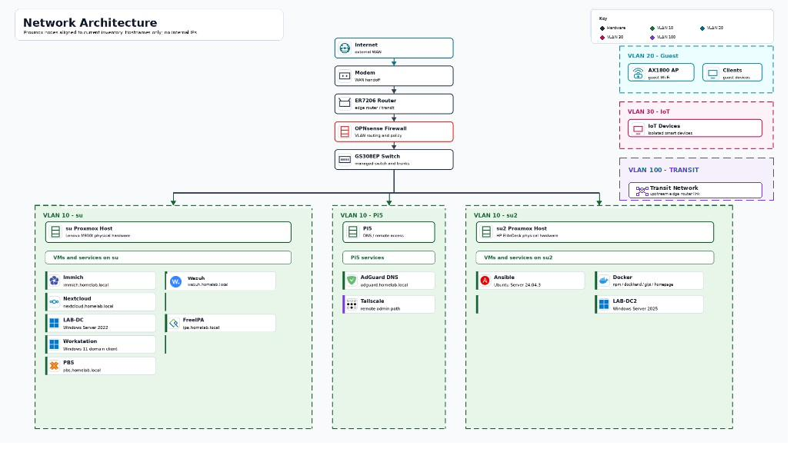

# Infrastructure & Security Portfolio

A two-node Proxmox cluster running enterprise infrastructure across virtualization, identity, networking, security, and automation. Primary landing page for architecture, documentation, and operational runbooks

Built by: Lamar Scott | GitHub: lamsec94 | Last updated: June 2026

---

## Architecture

---

## What I Built
Migrated a flat home network into a fully segmented, enterprise-style infrastructure across 5 VLANs with OPNsense handling all routing and firewall policy. Deployed a dual-node Proxmox cluster running 7 VMs and 3 LXC containers across Windows and Linux workloads. Implemented identity management with Active Directory (Windows Server 2022/2025), enterprise PKI with a wildcard certificate across all 14 internal HTTPS services, Suricata IDS on the LAB interface, and an Ansible automation layer managing the fleet across 5 inventory groups. All services are reverse-proxied through Nginx Proxy Manager with TLS termination via an internal CA.

---

## Hardware
| Node | Device          | RAM   | Role                          |
|------|-----------------|-------|-------------------------------|
| su1  | Lenovo M910t    | 48 GB | Primary Proxmox node          |
| su2  | HP EliteDesk    | 16 GB | Secondary Proxmox node        |
| Pi5  | Raspberry Pi 5  | 8 GB  | QDevice, Tailscale jumpbox, NetOps probe |
| —    | Netgear GS308EP | —     | Layer-2 VLAN switching        |
| —    | TP-Link ER7206  | —     | Upstream edge router          |
| —    | TP-Link AX1800  | —     | AP mode — GUEST + IOT SSIDs   |

---

## VLAN Design
| VLAN | Name    | Purpose                           |
|------|---------|-----------------------------------|
| 1    | MGMT    | Hypervisor and network management |
| 10   | LAB     | Servers, VMs, admin workstations  |
| 20   | GUEST   | Guest wireless isolation          |
| 30   | IOT     | IoT device isolation              |
| 100  | TRANSIT | Upstream link to edge router      |

---

## Service Inventory
| Service             | Type   | Internal URL                | Notes                            |
|---------------------|--------|-----------------------------|----------------------------------|
| OPNsense            | VM     | —                           | Firewall, Suricata IDS, DHCP     |
| LAB-DC (WS2022)     | VM     | —                           | Primary DC, DNS, ADCS, PKI       |
| LAB-DC2 (WS2025)    | VM     | —                           | Secondary DC        |
| Ansible Controller  | VM     | —                           | Ubuntu 24.04                     |
| Nextcloud           | LXC    | nextcloud.homelab.local     | File storage, laptop backup      |
| GLPI                | Docker | glpi.homelab.local          | ITSM, LDAP auth, asset discovery |
| Nginx Proxy Manager | Docker | npm.homelab.local           | Reverse proxy, wildcard HTTPS    |
| Immich              | LXC    | immich.homelab.local        | Photo management, Docker         |
| AdGuard Home        | Docker | adguard.homelab.local       | DNS, conditional forwarding      |
| Rocky10-serv        | VM     | rocky.homelab.local         | Rocky Linux 10, headless         |
| PBS                 | VM     | pbs.homelab.local           | Proxmox Backup Server            |
| LibreNMS            | Docker | librenms.homelab.local      | Network monitoring               |
| Win11 Pro           | VM     | —                           | Domain-joined admin workstation  |

---

## Identity & Access
Windows — Active Directory
- Domain: homelab.local | Primary DC: LAB-DC (WS2022) | Secondary: LAB-DC2 (WS2025)
- Tiered OU model separating admins, service accounts, groups, users, and computers — delegated Tier 1 help desk with zero group membership, AGDLP group nesting
- Five GPOs linked at a dedicated computer OU: screen lock (loopback processed), 7-Zip deployment, WSUS targeting, USB storage blocking, Features on Demand source override
- Enterprise Root CA (homelab-CA) via ADCS — wildcard cert covering all 14 internal services
- LDAP service account pattern (svc-glpi) for least-privilege third-party integration

Full detail: [active-directory-lab](https://github.com/lamsec94/active-directory-lab)

---

## Security & Monitoring
Suricata IDS
- Detection mode on the LAB interface — logs and alerts, does not block
- Alerts viewable in the OPNsense interface with automatic ruleset updates

Firewall Policy
- Default deny on all interfaces, no catch-all rules — 12 service-specific rules on the LAB interface

Hardening Baseline (Ansible-enforced on all Linux hosts)
- SSH key-only auth, ufw default-deny, fail2ban, scheduled patching

PKI
- All 14 services served over HTTPS with wildcard cert signed by internal homelab-CA
- CA cert distributed to system trust store and Firefox on Fedora admin workstation

---

## Automation
Ansible Controller on Ubuntu 24.04.

| Inventory Group  | Members                        |
|------------------|----------------------------------|
| proxmox_cluster  | proxmox1, proxmox2             |
| linux_vms        | ubuntu-server                  |
| windows_vms      | windows-dc, windows11, LAB-DC2 |
| lxc_containers   | nextcloud                      |
| docker_hosts     | docker-host                    |

Key playbooks:
- update-all.yml — fleet patching across apt/Docker/Windows; runtime reduced from 23 min to 2 min after SSH pipelining and module optimization
- deploy-glpi-agent.yml — cross-platform GLPI asset discovery agent deployment across Linux fleet

---

## Backup & Recovery
| Scope            | Tool                 | Schedule      | Notes                            |
|------------------|----------------------|---------------|-----------------------------------|
| VM snapshots     | Proxmox vzdump + PBS | Weekly Sunday | Both nodes                       |
| Laptop home dir  | Déjà Dup → Nextcloud | Scheduled     | Fedora workstation               |
| System snapshots | Timeshift (rsync)    | Pre-change    | Taken before all major changes   |
| Key VM snapshots | Proxmox manual       | Event-driven  | post-dc-promotion, glpi-baseline |

---

## Documentation
| Repository | Contents |
|---|---|
| [active-directory-lab](https://github.com/lamsec94/active-directory-lab) | AD domain design, OU structure, GPOs, PKI, LDAP integration |
| [Network-documentation](https://github.com/lamsec94/Network-documentation) | VLAN layout, OPNsense config, DNS architecture |
| [Runbooks](https://github.com/lamsec94/Runbooks) | Operational procedures, SOPs, change log, incident templates |
| [Glpi-itsm-deployment](https://github.com/lamsec94/Glpi-itsm-deployment) | ITSM platform deployment, LDAP auth, intake forms, asset discovery |

---

## Skills Demonstrated
Proxmox VE, Windows Server 2022/2025, Active Directory, Group Policy, ADCS / PKI, OPNsense, VLAN segmentation, Suricata IDS, Ansible, Docker, LXC, Linux administration, DNS, Nginx Proxy Manager, GLPI ITSM, Tailscale, Backup & Recovery, Infrastructure documentation

---

Email: scottlamar05@gmail.com
LinkedIn: linkedin.com/in/lamarscott
GitHub: github.com/lamsec94
