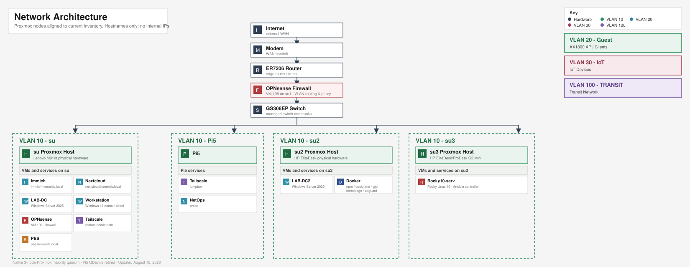

# Infrastructure & Security Portfolio
A three-node Proxmox cluster running enterprise infrastructure across virtualization, identity, networking, security, and automation. Primary landing page for architecture, documentation, and operational runbooks
Built by: Lamar Scott | GitHub: lamsec94 | Last updated: August 2026
---
## Architecture

---
## What I Built
Migrated a flat home network into a fully segmented, enterprise-style infrastructure across 5 VLANs with OPNsense handling all routing and firewall policy. Deployed a three-node Proxmox cluster running native majority quorum, with 6 VMs and 3 LXC containers across Windows and Linux workloads. Implemented identity management with Active Directory on Windows Server 2025, enterprise PKI with a wildcard certificate across all 15 internal HTTPS services, Suricata IDS on the LAB interface, and an Ansible automation layer managing the full fleet across 6 inventory groups. All services are reverse-proxied through Nginx Proxy Manager with TLS termination via an internal CA.

Most recent major work: added a third Proxmox node and converted the cluster from a two-node-plus-tiebreaker configuration to native three-node majority quorum, proven by taking a node offline mid-session and confirming the remaining two held quorum. In the same session, migrated the Ansible control node from Ubuntu to Rocky Linux, re-established SSH and WinRM trust across every managed host, and verified the change with a full, unmodified fleet-wide patch run. Detail in [certificate-authority.md](https://github.com/lamsec94/active-directory-lab/blob/main/docs/certificate-authority.md) for the earlier CA migration work.
---
## Hardware
| Node | Device          | RAM   | Role                          |
| ------ | ----------------- | ------- | ------------------------------- |
| su1  | Lenovo M910t    | 48 GB | Primary Proxmox node          |
| su2  | HP EliteDesk    | 16 GB | Secondary Proxmox node        |
| su3  | HP EliteDesk/ProDesk G2 Mini | 16 GB | Third Proxmox node — native quorum member |
| Pi5  | Raspberry Pi 5  | 8 GB  | Tailscale jumpbox, NetOps probe |
|      | Netgear GS308EP |       | Layer-2 VLAN switching        |
|      | TP-Link ER7206  |       | Upstream edge router          |
|      | TP-Link AX1800  |       | AP mode — GUEST + IOT SSIDs   |
---
## VLAN Design
| VLAN | Name    | Purpose                           |
| ------ | --------- | ----------------------------------- |
| 1    | MGMT    | Hypervisor and network management |
| 10   | LAB     | Servers, VMs, admin workstations  |
| 20   | GUEST   | Guest wireless isolation          |
| 30   | IOT     | IoT device isolation              |
| 100  | TRANSIT | Upstream link to edge router      |
---
## Service Inventory
| Service             | Type   | Internal URL                | Notes                            |
| --------------------- | -------- | ----------------------------- | ---------------------------------- |
| OPNsense            | VM     |                             | Firewall, Suricata IDS, DHCP     |
| LAB-DC (WS2025)     | VM     |                             | Domain controller, DNS, Global Catalog |
| LAB-DC2 (WS2025)    | VM     |                             | Domain controller, DNS, Global Catalog, all FSMO roles, Enterprise Root CA |
| WORKSTATION         | VM     |                             | Windows 11 Pro, domain-joined admin workstation |
| Rocky10-serv        | VM     | rocky.homelab.local         | Rocky Linux 10 — Ansible control node |
| Nextcloud           | LXC    | nextcloud.homelab.local     | File storage, laptop backup      |
| GLPI                | Docker | glpi.homelab.local          | ITSM, LDAP auth, asset discovery |
| Nginx Proxy Manager | Docker | npm.homelab.local           | Reverse proxy, wildcard HTTPS    |
| Immich              | LXC    | immich.homelab.local        | Photo management, Docker         |
| AdGuard Home        | Docker | adguard.homelab.local       | DNS, conditional forwarding      |
| PBS                 | VM     | pbs.homelab.local           | Proxmox Backup Server            |
| LibreNMS            | Docker | librenms.homelab.local      | Network monitoring               |
---
## Identity & Access
Windows — Active Directory
- Domain: homelab.local | Two domain controllers, both Windows Server 2025, both Global Catalogs, replicating across all five naming contexts
- All five FSMO roles held by LAB-DC2, which also hosts the Enterprise Root CA — the two roles that do not replicate are deliberately consolidated on one host
- Tiered OU model separating admins, service accounts, groups, users, and computers — delegated Tier 1 help desk with zero group membership, AGDLP group nesting
- Five GPOs linked at a dedicated computer OU: screen lock (loopback processed), software deployment, Windows Update targeting, removable storage restriction, Features on Demand source override
- Enterprise Root CA (homelab-CA) via ADCS — wildcard cert covering all 15 internal services, migrated between domain controllers with thumbprint-verified key continuity
- LDAP service account pattern (svc-glpi) for least-privilege third-party integration
Full detail: [active-directory-lab](https://github.com/lamsec94/active-directory-lab)
---
## Security & Monitoring
Suricata IDS
- Detection mode on the LAB interface — logs and alerts, does not block
- Alerts viewable in the OPNsense interface with automatic ruleset updates
Firewall Policy
- Default deny on all interfaces, no catch-all rules — 12 service-specific rules on the LAB interface
Hardening Baseline (Ansible-enforced on all Linux hosts)
- SSH key-only auth, ufw default-deny, fail2ban, scheduled patching
PKI
- All 15 services served over HTTPS with wildcard cert signed by internal homelab-CA
- CA cert distributed to system trust store and Firefox on Fedora admin workstation; domain members trust via Active Directory
- CA private key, certificate database, and registry configuration backed up as a unit — verified restorable by thumbprint and serial match rather than by service status
---
## Automation
Ansible control node runs on Rocky Linux 10, self-hosted alongside its own managed role. Installed as `ansible-core` from the OS package repository rather than a larger bundled distribution, keeping the control node's footprint deliberately small.
| Inventory Group  | Members                        |
| ------------------ | ---------------------------------- |
| proxmox_cluster  | su1, su2, su3                  |
| redhat_vms       | rocky10-serv (self-managed)    |
| windows_vms      | LAB-DC, LAB-DC2                |
| windows_practice | WORKSTATION                    |
| lxc_containers   | nextcloud                      |
| docker_hosts     | docker-host                    |
Key playbooks:
- update-all.yml — fleet patching across apt/dnf/Docker/Windows in a single run, using async execution and serial batching so the run survives individual SSH drops
- deploy-glpi-agent.yml — cross-platform GLPI asset discovery agent deployment across the Linux fleet
Most recent verification: after migrating the control node itself to new hardware, the full fleet was patched in one unmodified run with zero failures — proving the new controller before decommissioning the old one, not just testing connectivity to it.
---
## Backup & Recovery
| Scope            | Tool                 | Schedule      | Notes                            |
| ------------------ | ---------------------- | --------------- | ----------------------------------- |
| VM snapshots     | Proxmox vzdump + PBS | Weekly Sunday | All three nodes                  |
| Laptop home dir  | Déjà Dup → Nextcloud | Scheduled     | Fedora workstation               |
| System snapshots | Timeshift (rsync)    | Pre-change    | Taken before all major changes   |
| Key VM snapshots | Proxmox manual       | Event-driven  | pre-ca-migration, post-dc-promotion, glpi-baseline |
Hypervisor snapshots are taken on every host involved before any destructive or order-dependent operation. During the certificate authority migration and domain controller rebuild they were never needed, which is the intended outcome rather than an argument against taking them.
---
## Documentation
| Repository | Contents |
| --- | --- |
| [active-directory-lab](https://github.com/lamsec94/active-directory-lab) | AD domain design, OU structure, GPOs, PKI and CA migration, LDAP integration |
| [Network-documentation](https://github.com/lamsec94/Network-documentation) | VLAN layout, OPNsense config, DNS architecture |
| [Runbooks](https://github.com/lamsec94/Runbooks) | Operational procedures, SOPs, change log, incident templates |
| [Glpi-itsm-deployment](https://github.com/lamsec94/Glpi-itsm-deployment) | ITSM platform deployment, LDAP auth, intake forms, asset discovery |
---
## Skills Demonstrated
Proxmox VE, multi-node clustering and quorum, Windows Server 2025, Active Directory, Group Policy, ADCS / PKI, certificate authority migration, OPNsense, VLAN segmentation, Suricata IDS, Ansible, Docker, LXC, Linux administration, DNS, Nginx Proxy Manager, GLPI ITSM, Tailscale, Backup & Recovery, Infrastructure documentation
---
Email: scottlamar05@gmail.com
LinkedIn: linkedin.com/in/lamarscott
GitHub: github.com/lamsec94
